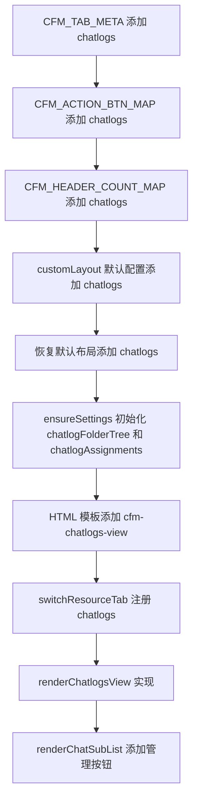
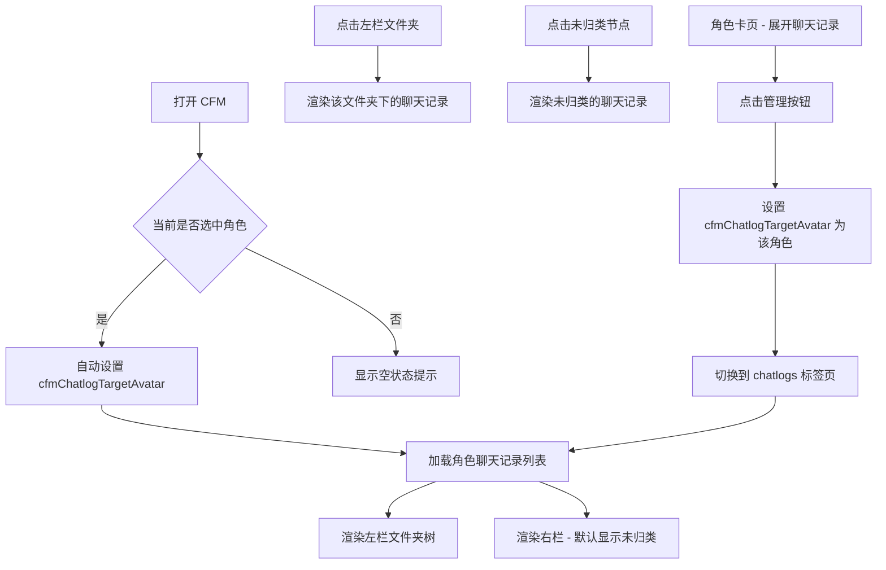

# 聊天记录标签页设计方案

## 1. 概述

在酒馆资源管理器（CFM）的顶部标签栏中，在「角色卡」和「世界书」之间新增一个「聊天记录」标签页，采用与其他资源页相同的左右分栏布局，支持对同一角色的聊天记录进行文件夹分类管理。

## 2. 核心需求

1. **标签页位置**：角色卡与世界书之间
2. **左右分栏**：左栏文件夹树 + 右栏聊天记录列表
3. **文件夹分类**：可创建文件夹对聊天记录进行归类管理
4. **子功能**：导入 / 备注 / 重命名 / 导出 / 删除
5. **默认行为**：只显示当前角色的聊天记录；新聊天默认在「未归类」
6. **空状态**：没有选中角色时显示空提示
7. **跨角色入口**：角色卡页 → 显示聊天记录 → 展开角色聊天 → 批量操作旁的「管理」按钮 → 跳转到对应角色的聊天记录页

## 3. 数据结构设计

### 3.1 聊天记录文件夹树

复用现有 `resourceFolderTree` 模式，在 `extension_settings` 中新增 `chatlogFolderTree` 字段：

```
extension_settings[extensionName].chatlogFolderTree = {
  // key = avatar（角色标识符），每个角色独立管理文件夹树
  "character_avatar.png": {
    // folderId -> { parentId, sortOrder, displayName? }
    "folder-uuid-1": { parentId: null, sortOrder: 1, displayName: "主线" },
    "folder-uuid-2": { parentId: null, sortOrder: 2, displayName: "支线" },
    "folder-uuid-3": { parentId: "folder-uuid-1", sortOrder: 1, displayName: "Chapter 1" }
  }
}
```

### 3.2 聊天记录归类映射

```
extension_settings[extensionName].chatlogAssignments = {
  // key = avatar, value = { chatFileName -> folderId }
  "character_avatar.png": {
    "chatFileName1": "folder-uuid-1",
    "chatFileName2": "folder-uuid-2"
    // 不在映射中的聊天记录 = 未归类
  }
}
```

### 3.3 标签页 ID

- `id: "chatlogs"`
- `label: "聊天记录"`
- `icon: "fa-comments"`

## 4. 架构设计

### 4.1 需要修改的位置（index.js）



### 4.2 具体修改点清单

#### 4.2.1 元数据注册（约第 4093-4376 行）

1. **CFM_TAB_META**（第 4093 行）：在 chars 和 worldinfo 之间插入
   ```js
   { id: "chatlogs", label: "聊天记录", icon: "fa-comments" },
   ```

2. **CFM_ACTION_META**（第 4103 行）：无需修改，已有 import/note/rename/export/delete

3. **CFM_HEADER_COUNT_MAP**（第 4306 行）：添加
   ```js
   chatlogs: "#cfm-chatlogs-rh-count",
   ```

4. **CFM_ACTION_BTN_MAP**（第 4316 行）：添加
   ```js
   chatlogs: {
     import: "#cfm-import-chatlog-btn",
     note: "#cfm-chatlog-note-btn",
     rename: "#cfm-chatlog-rename-btn",
     export: "#cfm-export-chatlog-btn",
     delete: "#cfm-res-delete-chatlog-btn",
   },
   ```

#### 4.2.2 设置初始化（约第 2606-2654 行）

在 `ensureResourceSettings()` 中添加：
```js
if (!extension_settings[extensionName].chatlogFolderTree)
  extension_settings[extensionName].chatlogFolderTree = {};
if (!extension_settings[extensionName].chatlogAssignments)
  extension_settings[extensionName].chatlogAssignments = {};
```

#### 4.2.3 默认布局配置（约第 3974 行和第 35794 行）

在 `customLayout.tabs` 中，chars 后面插入：
```js
{ id: "chatlogs", visible: true },
```

在 `customLayout.tabActions` 中添加：
```js
chatlogs: [
  { id: "import", visible: true },
  { id: "note", visible: true },
  { id: "rename", visible: true },
  { id: "export", visible: true },
  { id: "delete", visible: true },
],
```

在恢复默认布局的 `tabMenus` 中添加：
```js
chatlogs: { enabled: false },
```

#### 4.2.4 HTML 模板（约第 28565 行 cfm-chars-view 后面）

在 `cfm-chars-view` 和 `cfm-worldinfo-view` 之间插入新的 `cfm-chatlogs-view`：

```html
<div class="cfm-dual-pane" id="cfm-chatlogs-view" style="display:none;">
  <div class="cfm-left-pane">
    <div class="cfm-left-header">
      <span>文件夹</span>
      <span class="cfm-left-header-actions">
        <button class="cfm-quick-add-folder-btn" data-tab="chatlogs" title="新建文件夹">
          <i class="fa-solid fa-folder-plus"></i>
        </button>
        <button id="cfm-chatlogs-expand-all" title="展开全部">
          <i class="fa-solid fa-angles-down"></i>
        </button>
        <button id="cfm-chatlogs-collapse-all" title="收起全部">
          <i class="fa-solid fa-angles-up"></i>
        </button>
      </span>
    </div>
    <div class="cfm-left-tree" id="cfm-chatlogs-left-tree"></div>
  </div>
  <div class="cfm-right-pane">
    <div class="cfm-right-header">
      <span class="cfm-rh-path" id="cfm-chatlogs-rh-path">选择左侧文件夹查看内容</span>
      <span class="cfm-rh-count" id="cfm-chatlogs-rh-count"></span>
      <button class="cfm-import-btn" id="cfm-import-chatlog-btn" title="导入聊天记录">
        <i class="fa-solid fa-file-import"></i>
      </button>
      <input type="file" id="cfm-import-chatlog-file" multiple accept=".json,.jsonl" style="display:none;">
      <button class="cfm-edit-char-btn" id="cfm-chatlog-note-btn" title="编辑备注">
        <i class="fa-solid fa-pen-to-square"></i>
      </button>
      <button class="cfm-edit-char-btn" id="cfm-chatlog-rename-btn" title="重命名聊天记录">
        <i class="fa-solid fa-i-cursor"></i>
      </button>
      <button class="cfm-export-btn" id="cfm-export-chatlog-btn" title="导出聊天记录">
        <i class="fa-solid fa-file-export"></i>
      </button>
      <button class="cfm-res-delete-btn" id="cfm-res-delete-chatlog-btn" title="删除聊天记录">
        <i class="fa-solid fa-trash-can"></i>
      </button>
      <button class="cfm-multisel-toggle cfm-multisel-toggle-chatlogs" title="多选模式">
        <i class="fa-solid fa-list-check"></i>
      </button>
    </div>
    <div class="cfm-right-list" id="cfm-chatlogs-right-list">
      <div class="cfm-right-empty">← 点击左侧文件夹查看内容</div>
    </div>
  </div>
</div>
```

#### 4.2.5 搜索栏（约第 28500 行）

在搜索栏区域添加聊天记录的搜索栏：
```html
<div class="cfm-search-bar" id="cfm-chatlogs-search-bar" style="display:none;">
  <input type="text" id="cfm-chatlogs-search-input" placeholder="搜索聊天记录…">
  ...
</div>
```

#### 4.2.6 标签切换逻辑（约第 29163-29243 行）

在 `switchResourceTab` 函数中，所有 `.toggle()` 调用处添加 chatlogs：
```js
popup.find("#cfm-chatlogs-view").toggle(tab === "chatlogs");
popup.find("#cfm-chatlogs-search-bar").toggle(tab === "chatlogs");
```

在渲染分支中添加：
```js
else if (tab === "chatlogs") renderChatlogsView();
```

同样需要在 `syncTabSwitch`（约第 34742 行）中添加对应逻辑。

#### 4.2.7 showQuickAddFolderPopup（约第 8694 行）

添加 `chatlogs` 分支：
```js
} else if (tab === "chatlogs") {
  // 在当前角色的文件夹树中选中的父文件夹
  if (selectedChatlogTreeNode && ...) {
    parentId = selectedChatlogTreeNode;
  }
}
```

刷新视图分支添加：
```js
} else if (tab === "chatlogs") {
  renderChatlogsView();
}
```

#### 4.2.8 handleCurrentTabRelocate（约第 27121 行）

添加聊天记录标签页的定位逻辑。

#### 4.2.9 renderChatSubList 添加"管理"按钮（约第 27221 行）

在批量操作按钮后面添加管理按钮：
```js
<button class="cfm-btn cfm-btn-sm cfm-chat-manage-btn" title="管理聊天记录">
  <i class="fa-solid fa-folder-open"></i> 管理
</button>
```

## 5. 核心函数设计

### 5.1 文件夹管理函数

```
// 获取当前角色的聊天记录文件夹树
function getChatlogFolderTree(avatar)

// 保存聊天记录文件夹树
function saveChatlogTree(avatar)

// 添加聊天记录文件夹
function addChatlogFolder(avatar, folderId, parentId, displayName)

// 删除聊天记录文件夹
function removeChatlogFolder(avatar, folderId)

// 获取聊天记录的文件夹归属
function getChatlogAssignment(avatar, chatFileName)

// 设置聊天记录归属到文件夹
function assignChatlogToFolder(avatar, chatFileName, folderId)

// 从文件夹移除聊天记录归属（回到未归类）
function unassignChatlog(avatar, chatFileName)
```

### 5.2 视图渲染函数

```
// 渲染聊天记录标签页完整视图
async function renderChatlogsView()

// 渲染左栏文件夹树
function renderChatlogsLeftTree(avatar)

// 渲染右栏聊天记录列表
function renderChatlogsRightPane(avatar, folderId)

// 构建聊天记录行 HTML（复用现有 cfm-chat-row 结构）
function buildChatlogRowHtml(chat, avatar, isCurrentChat, note)
```

### 5.3 状态变量

```js
let selectedChatlogTreeNode = null;  // 当前选中的文件夹节点
let cfmChatlogTargetAvatar = null;   // 聊天记录页当前显示的角色 avatar
let cfmChatlogMultiSelected = new Set(); // 多选集合
```

## 6. 交互流程



## 7. 左栏文件夹树结构

```
📁 未归类（特殊虚拟节点，始终在最上方）
📁 主线
  📁 Chapter 1
  📁 Chapter 2  
📁 支线
📁 测试
```

- 「未归类」是一个虚拟节点，不存储在文件夹树中
- 选中「未归类」时，右栏显示所有没有归类的聊天记录
- 选中其他文件夹时，右栏显示该文件夹下的聊天记录
- 选中根节点（全部）时，显示所有聊天记录

## 8. 右栏聊天记录行

复用现有的 `cfm-chat-row` 样式和结构，包含：
- 聊天图标
- 聊天名称 + 当前标记
- 备注
- 元信息（消息数/文件大小/日期）
- 操作按钮（置顶/重命名/备注/导出/删除）
- 支持拖拽到左栏文件夹进行归类

## 9. 需要修改的代码位置汇总

| 文件      | 行号范围     | 修改内容                                      |
| --------- | ------------ | --------------------------------------------- |
| index.js  | ~2606-2654   | ensureResourceSettings 添加初始化             |
| index.js  | ~3974-4028   | customLayout 默认配置添加 chatlogs            |
| index.js  | ~4093-4101   | CFM_TAB_META 插入 chatlogs                    |
| index.js  | ~4306-4314   | CFM_HEADER_COUNT_MAP 添加 chatlogs            |
| index.js  | ~4316-4376   | CFM_ACTION_BTN_MAP 添加 chatlogs              |
| index.js  | ~8694-8888   | showQuickAddFolderPopup 添加 chatlogs 分支    |
| index.js  | ~27121-27125 | handleCurrentTabRelocate 添加 chatlogs        |
| index.js  | ~27217-27222 | renderChatSubList 添加管理按钮                |
| index.js  | ~28565-28600 | HTML 模板：在 chars-view 后添加 chatlogs-view |
| index.js  | ~28500       | 搜索栏添加 chatlogs-search-bar                |
| index.js  | ~29163-29243 | switchResourceTab 添加 chatlogs 分支          |
| index.js  | ~29204-29232 | 视图和搜索栏 toggle 添加 chatlogs             |
| index.js  | ~34789-34856 | syncTabSwitch 中添加 chatlogs 分支            |
| index.js  | ~35794-35873 | 恢复默认布局添加 chatlogs 配置                |
| index.js  | 新增区块     | 聊天记录标签页核心逻辑函数                    |
| style.css | 新增         | 聊天记录标签页相关样式                        |

## 10. CSS 样式

聊天记录标签页大部分样式可以复用现有的 `cfm-dual-pane`、`cfm-left-pane`、`cfm-right-pane`、`cfm-chat-row` 等样式。仅需少量新增样式用于：

- 无角色选中时的空状态提示
- 当前角色标题显示
- 拖拽归类时的视觉反馈
- 未归类节点的特殊样式
