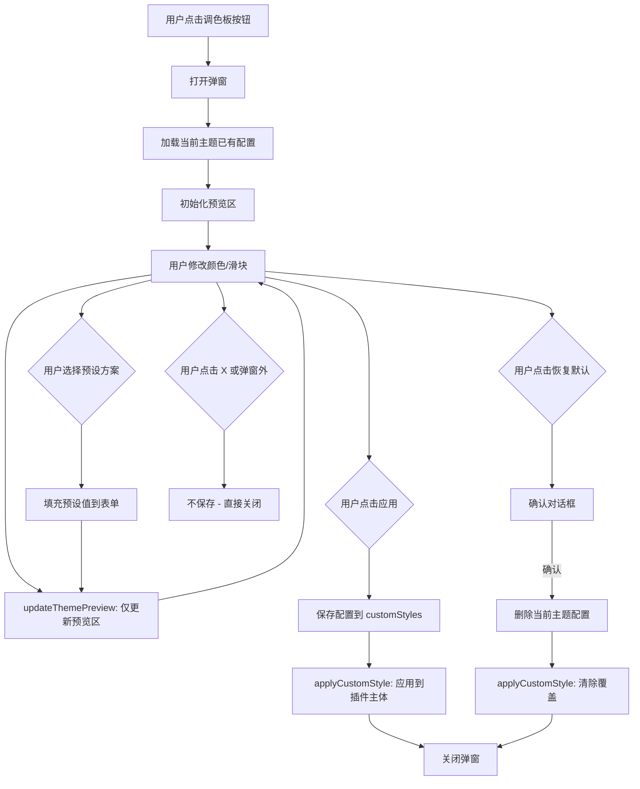

# 插件自定义美化功能 — 架构设计

## 问题背景

插件当前通过 `var(--SmartTheme*)` CSS 变量跟随酒馆主题，但某些主题会导致 `--SmartThemeBlurTintColor` 变为透明/半透明，使得插件弹窗背景难以阅读。需要让用户能够独立控制插件的视觉样式，且**按主题独立保存**。

## 总体方案

采用 **CSS 自定义属性覆盖** + **按主题名绑定存储** 机制：
1. 利用 CSS 自定义属性的继承特性，在 `#cfm-popup` 上直接覆盖 `--SmartTheme*` 变量值
2. 默认跟随酒馆主题（不覆盖任何变量）
3. 自定义样式按酒馆主题名分别存储，切换主题时自动应用对应的自定义样式
4. 不修改现有 style.css 中的 133 处 `var(--SmartTheme*)` 引用

## 架构细节

### 1. 顶部栏按钮位置

在 [`cfm-header-actions`](index.js:19338) 中，齿轮按钮 `#cfm-btn-config` 之前插入调色板按钮：

```
cfm-header-actions 布局:
[复制/移动] [🎨调色板] [⚙设置] [↔导入导出] [✕关闭]
```

- 按钮 ID: `#cfm-btn-theme`
- 图标: `fa-solid fa-palette`
- Title: `自定义外观`

### 2. 数据结构

存储在 `extension_settings[extensionName].customStyles` 中：

```javascript
customStyles: {
  // key = 酒馆主题名
  // value = 该主题下的自定义样式配置
  "主题A": {
    enabled: true,
    bgColor: "#1e1e2e",
    bgOpacity: 0.95,
    textColor: "#cdd6f4",
    borderColor: "#45475a",
    accentColor: "#89b4fa",
    blur: 0,
  },
  "主题B": null,  // null 或不存在 = 跟随主题默认
}
```

| 字段 | 类型 | 默认值 | 说明 |
|------|------|--------|------|
| `enabled` | boolean | false | 是否启用自定义样式 |
| `bgColor` | string/null | null | 弹窗背景色 hex，覆盖 `--SmartThemeBlurTintColor` |
| `bgOpacity` | number | 1.0 | 背景不透明度 0.0-1.0 |
| `textColor` | string/null | null | 文字颜色，覆盖 `--SmartThemeBodyColor` |
| `borderColor` | string/null | null | 边框颜色，覆盖 `--SmartThemeBorderColor` |
| `accentColor` | string/null | null | 强调色，覆盖 `--SmartThemeQuoteColor` |
| `blur` | number/null | null | 背景模糊值 px |

### 3. 获取当前主题名

```javascript
function getCurrentThemeName() {
  const themesSelect = document.getElementById('themes');
  return themesSelect?.value || '__default__';
}
```

### 4. CSS 变量覆盖机制

```javascript
function applyCustomStyle() {
  const themeName = getCurrentThemeName();
  const styles = extension_settings[extensionName].customStyles || {};
  const style = styles[themeName];
  const root = document.getElementById('cfm-popup');
  
  if (!root) return;
  
  // 清除所有之前的自定义
  root.style.removeProperty('--SmartThemeBlurTintColor');
  root.style.removeProperty('--SmartThemeBodyColor');
  root.style.removeProperty('--SmartThemeBorderColor');
  root.style.removeProperty('--SmartThemeQuoteColor');
  root.style.removeProperty('backdrop-filter');
  
  if (!style?.enabled) return;
  
  if (style.bgColor) {
    const rgba = hexToRgba(style.bgColor, style.bgOpacity ?? 1);
    root.style.setProperty('--SmartThemeBlurTintColor', rgba);
  }
  if (style.textColor)
    root.style.setProperty('--SmartThemeBodyColor', style.textColor);
  if (style.borderColor)
    root.style.setProperty('--SmartThemeBorderColor', style.borderColor);
  if (style.accentColor)
    root.style.setProperty('--SmartThemeQuoteColor', style.accentColor);
  if (style.blur > 0)
    root.style.setProperty('backdrop-filter', `blur(${style.blur}px)`);
}
```

### 5. 调色板弹窗 UI — 预览优先模式

**核心交互原则**：
- 修改颜色/滑块只更新弹窗顶部的**预览区**，不影响插件主界面
- 点击 [✓ 应用] → 保存配置 + 应用到插件 + 关闭弹窗
- 点击 [✕] 或弹窗外 → 不保存，不改变插件外观

```
┌───────────────────────────────────────┐
│  🎨 自定义外观                  [✕]  │
│  当前主题：Catppuccin Mocha          │
├───────────────────────────────────────┤
│  ┌─ 预览效果 ───────────────────┐    │
│  │  📁 示例文件夹               │    │
│  │  ├─ 角色卡名称               │    │
│  │  │  这是示例文字              │    │
│  │  ├─ 强调色文本示例            │    │
│  │  └─ 边框效果展示              │    │
│  └──────────────────────────────┘    │
│                                       │
│  [✓] 启用自定义样式                   │
│                                       │
│  背景颜色     [■ #1e1e2e] [↺]        │
│  背景不透明度  ═══════●═══  85%       │
│  文字颜色     [■ #cdd6f4] [↺]        │
│  边框颜色     [■ #45475a] [↺]        │
│  强调色       [■ #89b4fa] [↺]        │
│  背景模糊     ═══●═══════  10px      │
│                                       │
│  ──── 快捷预设 ────                   │
│  [🌙深色] [☀浅色] [💧透明] [◑高对比]  │
│                                       │
├───────────────────────────────────────┤
│  [🔄 恢复默认]              [✓ 应用]  │
└───────────────────────────────────────┘
```

### 6. 预览区实现方案

预览区是弹窗内一个独立的 `<div class="cfm-theme-preview">`，用 **内联样式 + CSS 变量** 来隔离展示效果：

```javascript
function updateThemePreview(previewEl, config) {
  const bgRgba = hexToRgba(config.bgColor || '#1e1e2e', config.bgOpacity ?? 1);
  const textColor = config.textColor || 'var(--SmartThemeBodyColor, #cdd6f4)';
  const borderColor = config.borderColor || 'var(--SmartThemeBorderColor, #45475a)';
  const accentColor = config.accentColor || 'var(--SmartThemeQuoteColor, #89b4fa)';
  const blur = config.blur || 0;
  
  // 在预览容器上设置局部 CSS 变量
  previewEl.style.setProperty('--preview-bg', bgRgba);
  previewEl.style.setProperty('--preview-text', textColor);
  previewEl.style.setProperty('--preview-border', borderColor);
  previewEl.style.setProperty('--preview-accent', accentColor);
  if (blur > 0) {
    previewEl.style.setProperty('backdrop-filter', `blur(${blur}px)`);
  } else {
    previewEl.style.removeProperty('backdrop-filter');
  }
}
```

预览区 HTML 结构（模拟插件实际外观）：

```html
<div class="cfm-theme-preview">
  <div class="cfm-theme-preview-header">
    <span class="cfm-theme-preview-title">📁 资源管理器</span>
    <span class="cfm-theme-preview-close">✕</span>
  </div>
  <div class="cfm-theme-preview-body">
    <div class="cfm-theme-preview-folder">
      <i class="fa-solid fa-folder"></i> 示例文件夹
    </div>
    <div class="cfm-theme-preview-item">
      <span class="cfm-theme-preview-name">角色卡名称</span>
      <span class="cfm-theme-preview-accent">强调色</span>
    </div>
    <div class="cfm-theme-preview-item">
      <span class="cfm-theme-preview-name">这是普通文字</span>
    </div>
    <div class="cfm-theme-preview-border-demo">边框效果</div>
  </div>
</div>
```

预览区 CSS 使用 `--preview-*` 变量（与插件主体的 `--SmartTheme*` 完全隔离）：

```css
.cfm-theme-preview {
  background-color: var(--preview-bg);
  color: var(--preview-text);
  border: 1px solid var(--preview-border);
  border-radius: 8px;
  padding: 12px;
  margin-bottom: 16px;
}
.cfm-theme-preview-accent {
  color: var(--preview-accent);
}
.cfm-theme-preview-border-demo {
  border: 1px solid var(--preview-border);
  padding: 4px 8px;
  border-radius: 4px;
}
```

### 7. 交互流程



### 8. 预设方案

```javascript
const CFM_STYLE_PRESETS = {
  dark: {
    name: '深色', icon: 'fa-moon',
    bgColor: '#1e1e2e', bgOpacity: 0.95,
    textColor: '#cdd6f4', borderColor: '#45475a',
    accentColor: '#89b4fa', blur: 0,
  },
  light: {
    name: '浅色', icon: 'fa-sun',
    bgColor: '#eff1f5', bgOpacity: 0.95,
    textColor: '#4c4f69', borderColor: '#ccd0da',
    accentColor: '#1e66f5', blur: 0,
  },
  transparent: {
    name: '半透明', icon: 'fa-droplet',
    bgColor: '#000000', bgOpacity: 0.6,
    textColor: '#ffffff', borderColor: 'rgba(255,255,255,0.2)',
    accentColor: '#89b4fa', blur: 10,
  },
  highContrast: {
    name: '高对比度', icon: 'fa-circle-half-stroke',
    bgColor: '#000000', bgOpacity: 1.0,
    textColor: '#ffffff', borderColor: '#ffffff',
    accentColor: '#00ff00', blur: 0,
  },
};
```

### 9. 主题切换联动

在 [`setupThemeBgBindingListener()`](index.js:3171) 中已有 `change.cfmBgBinding` 监听，追加：

```javascript
// 主题切换后延迟应用自定义样式（等主题CSS应用完）
setTimeout(() => applyCustomStyle(), 600);
```

### 10. 需要修改的文件和代码点

| 文件 | 位置 | 修改内容 |
|------|------|----------|
| [`index.js`](index.js) | ~line 922 | 添加 `customStyles: {}` 默认值 |
| [`index.js`](index.js) | line 19340 | 在 `#cfm-btn-config` 前插入 `#cfm-btn-theme` |
| [`index.js`](index.js) | 新函数 | `getCurrentThemeName()` |
| [`index.js`](index.js) | 新函数 | `applyCustomStyle()` |
| [`index.js`](index.js) | 新函数 | `showThemeCustomizePopup()` |
| [`index.js`](index.js) | 新函数 | `updateThemePreview()` |
| [`index.js`](index.js) | 新函数 | `resetCustomStyleForCurrentTheme()` |
| [`index.js`](index.js) | 新函数 | `hexToRgba()` |
| [`index.js`](index.js) | 新常量 | `CFM_STYLE_PRESETS` |
| [`index.js`](index.js) | line 3177 | 追加 `applyCustomStyle()` 调用 |
| [`index.js`](index.js) | showMainPopup 末尾 | 追加 `applyCustomStyle()` 调用 |
| [`index.js`](index.js) | 事件绑定区 | `#cfm-btn-theme` click |
| [`style.css`](style.css) | 新增 | 调色板弹窗 + 预览区样式 |

### 11. 注意事项

- **预览与实际隔离**：预览区使用独立的 `--preview-*` CSS 变量，修改过程中插件主体外观不变
- **点击应用才生效**：保存 + `applyCustomStyle()` + 关闭弹窗一步完成
- **关闭不保存**：点 ✕ 或弹窗外区域直接关闭，不影响任何设置
- **恢复默认防误触**：弹确认对话框
- **弹窗生命周期**：每次 `showMainPopup()` 重建 `#cfm-popup`，需在创建后调用 `applyCustomStyle()`
- **子弹窗继承**：在 `#cfm-popup` 内的子弹窗自动继承；body 级弹窗需额外处理
- **浮动按钮**：`#cfm-folder-button` 不在 `#cfm-popup` 内，如需自定义需单独处理
