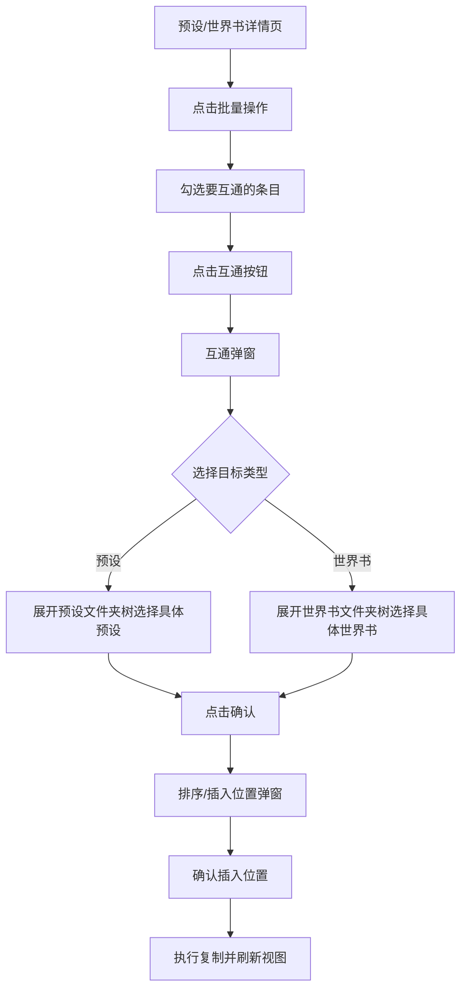

# 预设/世界书条目互通缝合 — 设计方案

## 1. 功能概述

在 CFM 的预设详情和世界书详情的**批量操作工具栏**中新增「互通」按钮，允许用户将选中的条目**复制**到另一个预设或世界书中，类似于现有的正则互通功能。

## 2. 支持的互通方向

| 来源                | 目标         | 复制规则                                                         |
| ------------------- | ------------ | ---------------------------------------------------------------- |
| 预设条目 → 预设     | 另一个预设   | 复制条目名称 + 内容（不删除源条目）                              |
| 预设条目 → 世界书   | 任意世界书   | 名称→key/comment, 内容→content, 其余字段用默认值（不删除源条目） |
| 世界书条目 → 世界书 | 另一本世界书 | 完整复制所有字段（不删除源条目）                                 |
| 世界书条目 → 预设   | 任意预设     | 名称→prompt name, 内容→prompt content（不删除源条目）            |

> **注意**：只有复制模式，不支持移动（不删除源条目）。

## 3. 用户操作流程



## 4. UI 设计

### 4.1 入口按钮

在预设详情和世界书详情的**批量操作工具栏**中，在已有按钮旁添加互通按钮：

**预设详情批量工具栏**（`.cfm-preset-detail-batch-*`）：

- 新增：`<button class="cfm-btn cfm-btn-sm cfm-entry-transfer-btn"><i class="fa-solid fa-right-left"></i> 互通</button>`

**世界书详情批量工具栏**（`.cfm-worldinfo-entry-batch-*`）：

- 新增：`<button class="cfm-btn cfm-btn-sm cfm-entry-transfer-btn"><i class="fa-solid fa-right-left"></i> 互通</button>`

### 4.2 互通弹窗

复用正则互通的弹窗风格（`.cfm-edit-popup-overlay` 模式），内容：

```
┌──────────────────────────────────┐
│  ↔ 条目互通                    │
├──────────────────────────────────┤
│  选择目标类型：                   │
│  ○ 预设 ▼    ○ 世界书 ▼         │
│                                  │
│  ┌─ 文件夹树 ──────────────────┐ │
│  │ 🔍 搜索...                  │ │
│  │ 📁 文件夹A                  │ │
│  │   📄 预设名1                │ │
│  │   📄 预设名2  ← 可点击选择   │ │
│  │ 📁 文件夹B                  │ │
│  │   📄 预设名3                │ │
│  │ 📄 未归类预设4              │ │
│  └──────────────────────────────┘ │
│  已选目标：预设名2                │
│                                  │
│         [取消]  [确认互通]        │
└──────────────────────────────────┘
```

**关键设计点**：

- 两个 radio 按钮选择目标类型（预设/世界书），旁边有小箭头展开/收起文件夹树
- 文件夹树样式复用 **原生文件夹过滤**（`.cfm-nf-panel`）的样式，但嵌入弹窗内
- 点击文件夹展开，显示该文件夹下的预设/世界书列表
- 点击具体的预设/世界书条目为选中状态（高亮）
- 顶部搜索栏可以快速过滤
- 底部显示「已选目标：xxx」

### 4.3 排序/插入位置弹窗

确认互通后弹出，复用正则互通的排序弹窗样式（`.cfm-sort-dialog`），显示目标预设/世界书已有的条目列表，让用户点击选择插入位置。

- **目标是预设时**：显示目标预设的 prompt 列表，点击某个条目表示「插入到这个条目之后」
- **目标是世界书时**：显示目标世界书的条目列表（自定义排序），点击表示「插入到此位置」
- 提供「插入到末尾」快捷选项
- 提供「跳过排序直接追加到末尾」的跳过按钮

## 5. 数据处理逻辑

### 5.1 预设条目 → 预设

```javascript
// 源：预设A的prompt条目
const sourcePrompt = { name: "xxx", content: "...", role: "system", ... }
// 目标：预设B
// 操作：在预设B的prompts数组中插入新条目
targetPreset.prompts.push({
  identifier: generateUniqueId(),
  name: sourcePrompt.name,
  content: sourcePrompt.content,
  role: sourcePrompt.role || "system",
  injection_position: 0,
  injection_depth: 4,
  // ... 其他默认值
})
```

### 5.2 预设条目 → 世界书

```javascript
// 源：预设的prompt条目
// 目标：世界书B
// 操作：调用 SillyTavern 的世界书API创建新条目
newEntry = {
  key: [sourcePrompt.name],
  comment: sourcePrompt.name,
  content: sourcePrompt.content,
  // 其余使用默认值（与点击新增条目效果一致）
  constant: false,
  selective: true,
  // ...
}
```

### 5.3 世界书条目 → 世界书

```javascript
// 源：世界书A的entry
// 目标：世界书B
// 操作：完整复制所有字段
newEntry = { ...sourceEntry, uid: newUid }
```

### 5.4 世界书条目 → 预设

```javascript
// 源：世界书的entry
// 目标：预设B
newPrompt = {
  identifier: generateUniqueId(),
  name: sourceEntry.comment || sourceEntry.key?.[0] || "untitled",
  content: sourceEntry.content,
  role: "system",
  // ... 默认值
}
```

## 6. 技术实现要点

### 6.1 获取预设数据

- 通过 `getContext().getPresetManager()` 获取 PromptManager
- 通过 `pm.serviceSettings.prompts` 获取当前预设的 prompt 列表
- 切换到目标预设需要临时 `pm.select.val(targetValue).trigger("change")`
- 操作完后恢复原预设选择

### 6.2 获取世界书数据

- 通过 SillyTavern 的 `/api/worldinfo/get` API 获取世界书数据
- 通过 `/api/worldinfo/edit` API 写入新条目
- 或直接操作运行时的 `world_info` 对象

### 6.3 文件夹树组件

- 复用已有的 `getResFolderTree` / `getResChildFolders` / `getResFolderDisplayName` 等函数
- 构建可展开/收起的文件夹树，每个文件夹下列出其包含的预设/世界书
- 搜索功能对预设名/世界书名进行实时过滤

### 6.4 ID 冲突处理

- 预设 prompt 的 `identifier` 需要生成新的唯一ID，避免与目标预设已有条目冲突
- 世界书 entry 的 `uid` 也需要生成新的

## 7. 重名处理

当目标预设/世界书中已有同名条目时，自动为新条目名称加后缀 `-1`、`-2`、`-3` 等，直到不再冲突。

## 8. 原子性与回滚

批量互通操作具有**原子性**：

- 先在内存中准备好所有条目
- 逐个插入，如果第 N 个条目失败，则**回滚**所有已插入的条目
- 向用户提示：「因为第 N 个条目失败，所以本次缝合失败」
- 回滚方式：删除本次已插入到目标的所有条目，恢复到操作前的状态

## 9. 潜在风险与注意事项

1. **预设切换副作用**：临时切换预设会触发 `OAI_PRESET_CHANGED_AFTER` 等事件，可能导致运行时状态变化。需要像正则互通一样使用 `suppressPresetRegexToast` 机制抑制不必要的 toastr
2. **世界书加载**：目标世界书可能未加载到内存中，需要先通过 API 拉取数据
3. **预设条目 identifier 唯一性**：PromptManager 内部对 identifier 有去重逻辑，新生成的 ID 必须全局唯一
4. **保存时机**：预设修改后需要持久化到文件（调用 `savePresetDebounced` 或类似机制），世界书修改同理
5. **批量操作性能**：大量条目互通时可能触发多次渲染，需要适当防抖

## 10. 实现步骤（初步分解）

0. **前置改进：解除非当前预设的批量操作限制** — 当前代码中 `isCurrentApplied` 检查会禁用非当前应用预设的批量操作按钮和分组按钮。需要移除或放宽此限制，允许用户对任意预设进行批量选择和互通操作（至少互通/复制操作不应受限于当前预设，因为互通只是读取源条目数据，不需要修改运行时的 PromptManager 状态）。涉及代码位置：`isCurrentApplied` 检查（约 index.js:15707-15708 周围）。
1. 在预设详情批量工具栏添加互通按钮
2. 在世界书详情批量工具栏添加互通按钮
3. 实现互通弹窗 UI（目标类型选择 + 文件夹树 + 搜索）
4. 实现文件夹树内嵌的预设/世界书列表展示
5. 实现排序/插入位置弹窗
6. 实现预设→预设的条目复制逻辑
7. 实现预设→世界书的条目复制逻辑
8. 实现世界书→世界书的条目复制逻辑
9. 实现世界书→预设的条目复制逻辑
10. 处理边界情况（ID冲突、保存、刷新视图）
