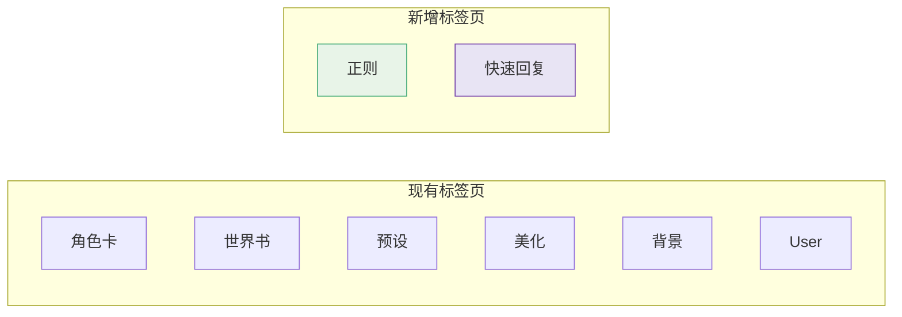
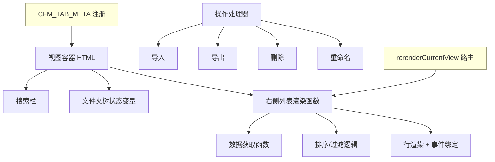

# 正则 & 快速回复 分类标签页 — 架构讨论

## 一、数据结构调研总结

### 1. 正则 (Regex) 系统

**三种脚本类型：**

| 类型   | 存储位置                                              | 访问方式                                 | 作用域             |
| ------ | ----------------------------------------------------- | ---------------------------------------- | ------------------ |
| Global | `extension_settings.regex[]`                          | 直接读取                                 | 全局，所有聊天生效 |
| Scoped | `characters[this_chid].data.extensions.regex_scripts` | 需选中角色                               | 仅当前角色生效     |
| Preset | PresetManager 内部存储                                | `presetManager.readPresetExtensionField` | 仅当前预设生效     |

**单个脚本的数据结构 (RegexScriptData)：**

```
id: string          // UUID
scriptName: string  // 脚本名称
findRegex: string   // 查找正则
replaceString: string // 替换字符串
trimStrings: string[] // 修剪字符串
placement: number[] // 应用位置
disabled: boolean   // 是否禁用
markdownOnly / promptOnly / runOnEdit: boolean
substituteRegex: number
minDepth / maxDepth: number
```

**关键 API：**

- `getScriptsByType(type)` → 获取指定类型的脚本列表
- `saveScriptsByType(scripts, type)` → 保存指定类型的脚本列表
- 导出：`download(JSON.stringify(script), fileName, 'application/json')`
- 无独立文件系统，数据存储在 settings 中

---

### 2. 快速回复 (Quick Reply) 系统

**层级结构：**

```
QuickReplySettings
  ├── config (global)          → QuickReplyConfig → setList: QuickReplySetLink[]
  ├── chatConfig (per-chat)    → QuickReplyConfig → setList: QuickReplySetLink[]
  └── characterConfigs (per-char) → {avatar: QuickReplyConfig}

QuickReplySet.list[]  ← 全局静态列表，所有 QR Set 的集合
  └── QuickReplySet
        ├── name: string
        ├── scope: 'global' | 'chat' | 'character'
        ├── color / onlyBorderColor
        ├── disableSend / placeBeforeInput / injectInput
        └── qrList: QuickReply[]
              ├── id: number
              ├── label: string
              ├── icon: string
              ├── message: string (slash command)
              ├── title: string
              ├── isHidden: boolean
              └── executeOn* 系列触发器
```

**关键 API：**

- 加载：`/api/settings/get` → `response.quickReplyPresets`
- 保存：`/api/quick-replies/save` (POST, body: QRSet JSON)
- 删除：`/api/quick-replies/delete` (POST, body: QRSet JSON)
- 运行时列表：`QuickReplySet.list[]`（静态数组）
- 持久化设置：`extension_settings.quickReplyV2`

---

## 二、与现有标签页的本质差异

现有的 6 个标签页（角色卡/世界书/预设/美化/背景/User）管理的都是**文件系统资源**（角色 PNG、JSON 预设文件、背景图片等），具有明确的文件路径和独立的导入/导出 API。

正则和快速回复则是**设置级资源**：

| 特征      | 文件系统资源      | 设置级资源                  |
| --------- | ----------------- | --------------------------- |
| 存储方式  | 独立文件          | settings.json 中的数组/对象 |
| 唯一标识  | 文件名/路径       | UUID 或 name                |
| 导入/导出 | 文件上传/下载 API | JSON 序列化/反序列化        |
| 文件夹    | 可映射到真实目录  | 纯虚拟分组                  |
| 数量级    | 可能数百/数千     | 通常数十个                  |

这意味着：

1. **文件夹系统完全是虚拟的** — 只能用插件自身的 `extension_settings` 存储分组关系
2. **导入/导出需要自定义实现** — 无法复用现有的文件上传 API
3. **数据获取是同步的** — 直接从内存读取，无需 API 调用

---

## 三、设计方案讨论

### 方案概览



---

### 3.1 正则标签页设计

#### 管理粒度：以「单个脚本」为列表项

**左侧文件夹树：**

```
📁 全部脚本
├── 📁 全局脚本 (Global)
├── 📁 角色脚本 (Scoped) — 仅当选中角色时可用
├── 📁 预设脚本 (Preset) — 仅当选中预设时可用
└── 📁 用户自定义文件夹...
```

**右侧列表项显示：**

```
[✓/✗] [脚本名称]    [类型标签: Global/Scoped/Preset]    [☆]
        ↳ 查找: /regex_pattern/gi  →  替换: replacement_string
```

**支持的操作：**

- 导入：JSON 文件导入单个脚本
- 导出：导出为 JSON 文件（单个或批量 ZIP）
- 删除：删除脚本
- 重命名：修改脚本名称
- 启用/禁用：切换 disabled 状态
- 类型移动：在 Global ↔ Scoped ↔ Preset 之间移动
- 虚拟文件夹分组

#### 关键问题讨论

**问题 1：是否管理所有三种类型？**

- **方案 A**：仅管理 Global 脚本 — 最简单，不依赖角色/预设状态
- **方案 B**：管理所有三种，按类型分组 — 功能最全面，但 Scoped 和 Preset 依赖上下文
- **推荐方案 B**，但对 Scoped/Preset 添加上下文提示（如"需选中角色"）

**问题 2：虚拟文件夹的 ID 策略**

- 正则脚本已有 UUID（`script.id`），可直接作为资源 ID
- 文件夹映射存储在 `extension_settings[extensionName].regexFolders`

---

### 3.2 快速回复标签页设计

#### 管理粒度的选择

**两种候选方案：**

| 方案   | 列表项                 | 展开后                 | 类比                 |
| ------ | ---------------------- | ---------------------- | -------------------- |
| 方案 A | QuickReplySet（QR 集） | 展开显示内部的 QR 条目 | 类似角色卡的聊天模式 |
| 方案 B | 单个 QuickReply 条目   | 无展开                 | 扁平列表             |

**推荐方案 A**：以 QuickReplySet 为主列表项

理由：

1. QR Set 是酒馆原生的组织单位，与原生 UI 概念一致
2. QR Set 数量通常较少（几个到十几个），适合列表展示
3. 可以展开显示内部条目，类似角色卡的聊天记录展开模式
4. 导入/导出/删除等操作以 Set 为单位最合理

**左侧文件夹树：**

```
📁 全部 QR Set
├── 📁 已启用 (当前生效)
│   ├── 🌐 全局启用
│   ├── 💬 聊天启用
│   └── 👤 角色启用
├── 📁 未启用
└── 📁 用户自定义文件夹...
```

**右侧列表项显示：**

```
[▶] [QR Set 名称]    [条目数: 5]    [作用域标签]    [颜色指示]
     展开后:
     ├── QR1: label1 — /slash_command ...
     ├── QR2: label2 — /另一个命令 ...
     └── QR3: label3 — 纯文本消息...
```

**支持的操作（Set 级别）：**

- 导出：导出整个 QR Set 为 JSON
- 导入：导入 QR Set JSON
- 删除：删除整个 QR Set
- 重命名：修改 Set 名称
- 批量导出/删除
- 虚拟文件夹分组

**支持的操作（QR 条目级别）：**

- 导出单个 QR 条目
- 在 Set 之间移动/复制 QR 条目
- 查看/编辑（跳转到原生编辑器）

#### 关键问题讨论

**问题 1：作用域过滤**

- QR Set 本身无作用域标记，作用域由 QuickReplyConfig.setList 决定
- 可以根据当前激活状态（全局/聊天/角色）做分类过滤

**问题 2：与原生 UI 的交互**

- 点击 QR Set 是否跳转到原生编辑界面？
- 还是在插件内提供简化编辑？
- 推荐：点击跳转到原生编辑器（与角色卡点击打开聊天一致）

---

## 四、实现架构

### 新增标签页需要的组件清单

每个新标签页需要实现以下内容（参照现有标签页模式）：



### 数据访问层

```
正则：
  读取: getScriptsByType(SCRIPT_TYPES.GLOBAL) → 直接从内存获取
  保存: saveScriptsByType(scripts, type) → 写入 settings
  导出: JSON.stringify(script) → 下载
  导入: JSON.parse(fileContent) → 加入列表 + save

快速回复：
  读取: QuickReplySet.list → 直接从内存获取
  保存: fetch '/api/quick-replies/save' → 服务端持久化
  删除: fetch '/api/quick-replies/delete' → 服务端持久化
  导出: JSON.stringify(qrSet.toJSON()) → 下载
  导入: JSON.parse(fileContent) → QuickReplySet.from + save
```

### 文件夹存储

```javascript
extension_settings[extensionName].regexFolders = {
  // scriptId → folderPath
  'uuid-1': '/全局/文本处理',
  'uuid-2': '/全局/格式化',
};

extension_settings[extensionName].qrFolders = {
  // setName → folderPath  
  'MyQRSet1': '/常用',
  'MyQRSet2': '/调试工具',
};
```

---

## 五、待讨论的开放问题

1. **正则 Scoped/Preset 脚本是否纳入管理？** 还是仅管理 Global 脚本？
2. **QR 标签页点击行为**：跳转到原生编辑器 vs 插件内提供简化编辑？
3. **Tab 顺序和图标**：正则和 QR 应该放在哪个位置？
4. **是否需要"新建"功能**：是否在插件内支持创建新的正则脚本/QR Set？还是只做分类管理？
5. **搜索功能**：正则脚本按脚本名搜索？QR Set 按名称搜索？还是也搜索内容？
6. **优先级**：先实现哪个标签页？正则还是快速回复？
