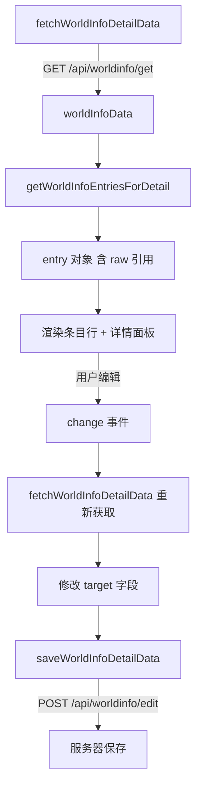

# CFM 世界书条目详情编辑面板重构方案

## 1. 目标

将 CFM 世界书查看详情面板从**只读展示**重构为**完整可编辑面板**，与酒馆原生世界书条目展开详情一致。

## 2. 现状分析

### 2.1 现有 CFM 条目详情（只读）

当前详情面板位于 [`index.js`](index.js:13154)，点击编辑按钮（`.cfm-worldinfo-entry-edit`）后展示以下**只读**信息：

- 条目备注（comment）
- 主触发词（primaryKeys）
- 次触发词（secondaryKeys）
- 内容（content）
- 元信息（order + flags）

### 2.2 酒馆原生条目详情（完整可编辑）

酒馆原生 HTML 模板位于 [`index.html`](../../../../index.html:6563)，JS 逻辑位于 [`world-info.js`](../../../world-info.js:3454)。包含以下可编辑字段：

| 区域 | 字段 | 控件类型 | 数据字段名 |
|------|------|---------|------------|
| 关键词与逻辑 | 主触发词 | textarea/tags | `key` |
| 关键词与逻辑 | 逻辑类型 | select | `selectiveLogic` |
| 关键词与逻辑 | 次触发词 | textarea/tags | `keysecondary` |
| 条目覆盖 | Outlet Name | text input | `outletName` |
| 条目覆盖 | Scan Depth | number input | `scanDepth` |
| 条目覆盖 | Case-Sensitive | select 三态 | `caseSensitive` |
| 条目覆盖 | Whole Words | select 三态 | `matchWholeWords` |
| 条目覆盖 | Group Scoring | select 三态 | `useGroupScoring` |
| 条目覆盖 | Automation ID | text input | `automationId` |
| 条目覆盖 | Recursion Level | text input | `delayUntilRecursion` |
| 内容区 | Content | textarea | `content` |
| 内容区 | Non-recursable | checkbox | `excludeRecursion` |
| 内容区 | Prevent further recursion | checkbox | `preventRecursion` |
| 内容区 | Delay until recursion | checkbox | `delayUntilRecursion` |
| 内容区 | Ignore budget | checkbox | `ignoreBudget` |
| 分组 | Inclusion Group | text input | `group` |
| 分组 | Prioritize | checkbox | `groupOverride` |
| 分组 | Group Weight | number input | `groupWeight` |
| 时间控制 | Sticky | number input | `sticky` |
| 时间控制 | Cooldown | number input | `cooldown` |
| 时间控制 | Delay | number input | `delay` |
| 过滤 | Character Filter | multi-select | `characterFilter` |
| 过滤 | Character Exclusion | checkbox | `characterFilter.isExclude` |
| 过滤 | Generation Triggers | multi-select | `triggers` |
| 底部控件 | Selective | checkbox | `selective` |
| 底部控件 | Use Probability | checkbox | `useProbability` |
| 匹配源 | Character Description | checkbox | `matchCharacterDescription` |
| 匹配源 | Character Personality | checkbox | `matchCharacterPersonality` |
| 匹配源 | Scenario | checkbox | `matchScenario` |
| 匹配源 | Persona Description | checkbox | `matchPersonaDescription` |
| 匹配源 | Characters Note | checkbox | `matchCharacterDepthPrompt` |
| 匹配源 | Creators Notes | checkbox | `matchCreatorNotes` |

### 2.3 现有数据流



## 3. 架构设计

### 3.1 设计原则

1. **布局分区与酒馆原生一致**：按酒馆原生的区域划分来组织字段
2. **紧凑适配**：CFM 面板宽度有限，需要自适应布局，使用 CSS Grid/Flexbox wrap
3. **即时保存**：每个字段变更时立即保存（与已有行内编辑控件一致的 fetch→modify→save 模式）
4. **保持已有行内控件**：条目标题行的 position/depth/order/probability/state 控件保持不变
5. **Comment 字段特殊处理**：comment 在酒馆中是条目的标签/备注，编辑后需要同步更新标题行显示

### 3.2 详情面板布局设计

详情面板分为以下区域，从上到下排列：

```
┌─────────────────────────────────────────────────────┐
│ 区域1: 关键词与逻辑                                    │
│ ┌──────────────┐ ┌────────┐ ┌──────────────┐        │
│ │ 主触发词      │ │ 逻辑    │ │ 次触发词      │        │
│ │ textarea     │ │ select │ │ textarea     │        │
│ └──────────────┘ └────────┘ └──────────────┘        │
├─────────────────────────────────────────────────────┤
│ 区域2: 条目备注 Comment                               │
│ ┌─────────────────────────────────────────────────┐  │
│ │ textarea                                       │  │
│ └─────────────────────────────────────────────────┘  │
├─────────────────────────────────────────────────────┤
│ 区域3: 内容 Content                                   │
│ ┌─────────────────────────────────────────────────┐  │
│ │ textarea rows=6                                │  │
│ └─────────────────────────────────────────────────┘  │
│ UID: xxx  Token count: xxx                          │
├─────────────────────────────────────────────────────┤
│ 区域4: 条目覆盖设置                                    │
│ ┌────────┐┌────────┐┌──────┐┌──────┐┌──────┐        │
│ │Outlet  ││ScanDep ││Case  ││Whole ││GrpSc │        │
│ └────────┘└────────┘└──────┘└──────┘└──────┘        │
│ ┌────────────┐ ┌──────────────┐                      │
│ │Automation  │ │Recursion Lvl │                      │
│ └────────────┘ └──────────────┘                      │
├─────────────────────────────────────────────────────┤
│ 区域5: 分组与时间控制                                   │
│ ┌──────────┐┌────────┐┌──────┐┌────────┐┌──────┐    │
│ │IncGrp   ││GrpWght ││Sticky││Cooldown││Delay │    │
│ └──────────┘└────────┘└──────┘└────────┘└──────┘    │
│ □ Prioritize                                        │
├─────────────────────────────────────────────────────┤
│ 区域6: 选项复选框                                      │
│ □ Non-recursable  □ Prevent recursion                │
│ □ Delay until rec □ Ignore budget                    │
│ □ Selective       □ Use Probability                  │
├─────────────────────────────────────────────────────┤
│ 区域7: 过滤器                                         │
│ Character Filter: [multi-input] □ Exclude            │
│ Generation Triggers: [multi-select]                  │
├─────────────────────────────────────────────────────┤
│ 区域8: 额外匹配源（可折叠）                              │
│ □ Character Description  □ Persona Description       │
│ □ Character Personality  □ Characters Note           │
│ □ Scenario              □ Creators Notes             │
└─────────────────────────────────────────────────────┘
```

### 3.3 数据保存策略

沿用已有模式：每个控件的 `change`/`input` 事件触发时：
1. 调用 [`fetchWorldInfoDetailData(bookName)`](index.js:10944) 获取最新数据
2. 修改对应 entry 的字段
3. 调用 [`saveWorldInfoDetailData(bookName, data)`](index.js:10958) 保存
4. 对于 comment/key 等影响标题行显示的字段，保存后调用 [`refreshWorldInfoPanelView()`](index.js:10896) 刷新

对于文本输入字段（content、comment、key、keysecondary 等），使用 debounce 延迟保存避免频繁请求。

### 3.4 特殊字段处理

#### 3.4.1 主触发词 / 次触发词
- 酒馆原生使用 select2 多选标签或 textarea 纯文本模式
- CFM 中简化为 **textarea + 逗号分隔**：用户输入逗号分隔的关键词列表
- 保存时将字符串按逗号分割为数组

#### 3.4.2 Character Filter
- 酒馆原生使用 select2 多选从角色/标签列表中选择
- CFM 中简化为 **textarea + 逗号分隔**：显示当前过滤的角色名和标签名
- 需要从 `entry.characterFilter.names` 和 `entry.characterFilter.tags` 读取
- 编辑后需要拆分并写回

#### 3.4.3 Generation Triggers
- 酒馆原生使用 select2 多选
- CFM 中使用**多个 checkbox**实现：Normal、Continue、Impersonate、Swipe、Regenerate、Quiet

#### 3.4.4 三态布尔下拉
- `caseSensitive`、`matchWholeWords`、`useGroupScoring` 三个字段
- 值为 `null`（使用全局设置）、`true`（是）、`false`（否）
- 使用 `<select>` 三选项实现

#### 3.4.5 delayUntilRecursion
- 既是复选框 checkbox 又有 Recursion Level 输入
- checkbox 控制是否启用，Level 输入控制层级数
- 值为 `false`（禁用）、`true`（启用，默认层级1）、数字（启用，指定层级）

## 4. 实施步骤

### Step 1: 重构详情面板 HTML 模板

替换 [`index.js`](index.js:13154) 中 `isDetailOpen` 条件块的 HTML，从只读展示改为可编辑控件面板。

**涉及代码位置**：约 `index.js:13154-13181`

### Step 2: 绑定所有字段的编辑事件

在现有行内控件事件绑定之后（`index.js:13341-13429`），添加详情面板中所有编辑控件的事件处理。

**字段分组**：
- **文本字段**（debounced）：`comment`、`content`、`outletName`、`group`、`automationId`
- **数组字段**（debounced）：`key`、`keysecondary`
- **数字字段**：`scanDepth`、`groupWeight`、`sticky`、`cooldown`、`delay`、`delayUntilRecursion` level
- **下拉字段**：`selectiveLogic`、`caseSensitive`、`matchWholeWords`、`useGroupScoring`
- **复选框字段**：`excludeRecursion`、`preventRecursion`、`delayUntilRecursion`、`ignoreBudget`、`selective`、`useProbability`、`groupOverride`
- **匹配源复选框**：`matchCharacterDescription`、`matchCharacterPersonality`、`matchScenario`、`matchPersonaDescription`、`matchCharacterDepthPrompt`、`matchCreatorNotes`
- **复杂字段**：`characterFilter`（names + tags + isExclude）、`triggers`

### Step 3: 添加 CSS 样式

在 [`style.css`](style.css) 中添加详情编辑面板的样式：
- `.cfm-wi-detail-edit` 主容器
- `.cfm-wi-detail-section` 各区域
- `.cfm-wi-detail-row` 行布局
- `.cfm-wi-detail-field` 字段容器
- `.cfm-wi-detail-label` 字段标签
- 控件尺寸、间距、颜色等

### Step 4: 处理编辑后的联动

- 编辑 `comment`/`key` 后需刷新标题行的 label 文字
- 编辑 `position`/`depth`/`order`/`probability`/`constant`/`vectorized` 后需同步行内控件
- 编辑 `disable` 后需同步激活按钮

## 5. 技术风险与应对

| 风险 | 应对 |
|------|------|
| Character Filter 需要角色列表数据 | 使用 `getContext().characters` 获取角色列表 |
| select2 在 CFM 面板中可能样式冲突 | 不使用 select2，改用简单的 textarea 逗号分隔方案 |
| 频繁保存请求 | 文本字段使用 debounce（500ms） |
| 详情面板过宽 | 使用 flex-wrap 自适应，小屏幕下字段自动换行 |
| 编辑 comment 后标题行不更新 | 保存成功后调用 refreshWorldInfoPanelView 刷新 |
